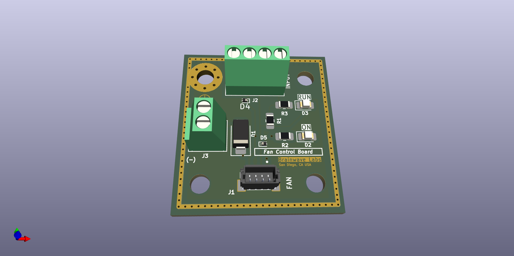
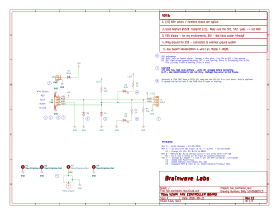
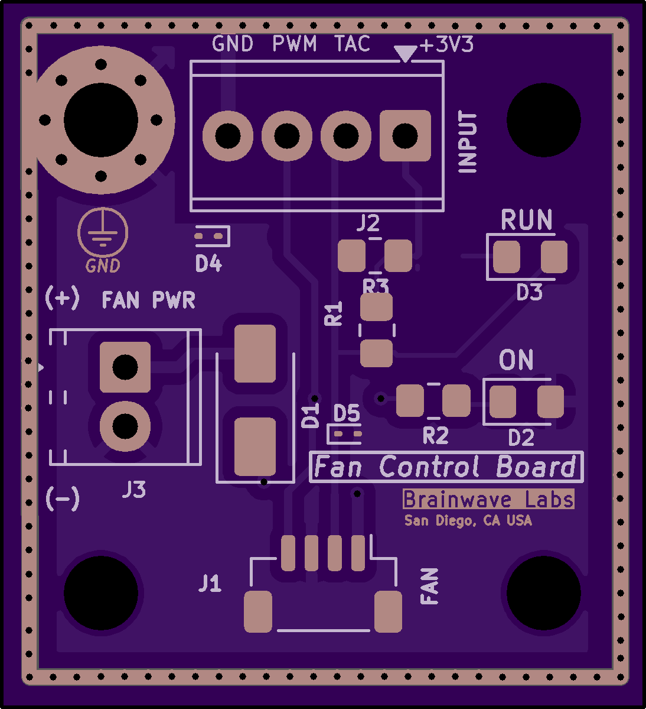

# Pi_Chassis_Fan_Controller
A small board to interface a 5V, 4-wire  fan in a controller cabinet with a Raspberry Pi controller. 

  

## Overview
I am working on a Raspberry Pi 4 controlled LTE gateway using a small DIN rail enclosure.  The planned locations are at fairly remote and the equipment will be enclosed in a small cabinet so active ventilation is required.  This board was needed to simplify installation and to provide some visual and remote feedback.  This is a fairly simple board that is tailored to my specific installations but I may expand it to be more general purpose.  In any case it provides a neat interface to control a cabinet fan

  

The schematic is pretty straightforward.  It uses a hybrid SMT + Through-hole technologies. 

---

## Hardware Description
The hardware combines familiar building blocks with a some added protection from the warm and dry environment.  Extras such as a static ring ground and ESD diodes are probably overkill but it is cheap insurance.  

  *I am not 100% sure if the "Ring Ground" is implemented correctly.  ...But it looks cool?*

  

It is a approximately 1" x 1" and is designed to fit on a small DIN rail carrier. The board is available on OSHPARK Shared and I will leave a link. [ www.oshpark](https://oshpark.com)

---

## Example Software

*Coming Soon! - no, really.  Check back*
